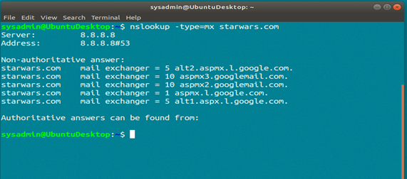
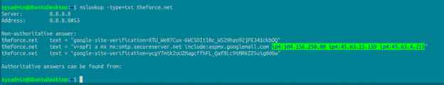
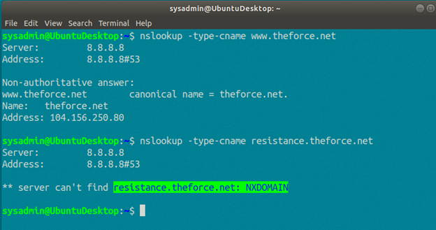
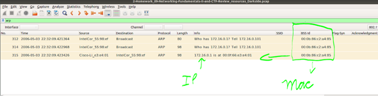
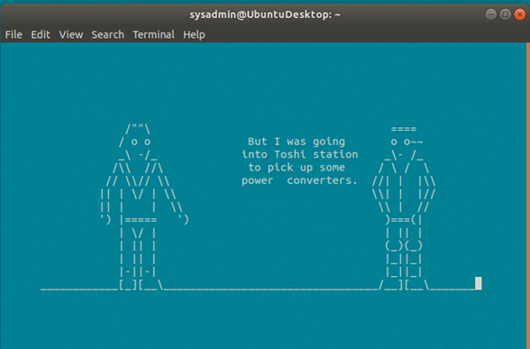

## Mission in A Network Far, Far Away!

### **Mission 1**

**The Resistance (starwars.com) is able to send emails but unable to receive any. Explain why the Resistance isn't receiving any emails**
- The Resistance is not being able to receive emails because `asltx.l.google.com` and `asltx.2.google.com` are not in the mail exchange list. The Resistance has to fix the DNS, in other words, they have to add those two mail servers to be able to communicate effectively.


<br>
<br>

### **Mission 2**

**Now that you've addressed the mail servers, all emails are coming through. However, users are still reporting that they haven't received mail from the `theforce.net` alert bulletins. Many of the alert bulletins are being blocked or going into spam folders.**

**These alerts are critical to identify pending attacks from the Empire. Explain why the Force's emails are going to spam.**
- The reason why the Force’s emails are going to spam is that the new IP address `45.23.176.21` is not linked to the `theforce.net` domain. A correct DNS record has to have its A record updated with the Domain Name System correspondent and IP address or addresses correspondents.


<br>
<br>

### **Mission 3**

**You have successfully resolved all email issues and the resistance can now receive alert bulletins. However, the Resistance is unable to easily read the details of alert bulletins online. They are supposed to be automatically redirected from their sub page of `resistance.theforce.net`  to `theforce.net`**

**Explain why the sub page of resistance.theforce.net isn't redirecting to theforce.net**
- The `resistance.theforce.net` is not redirecting to `theforce.net`, because the subpage is not linked to the primary domain. To work as it should, the `resistance.theforce.net` has to be added to `theforce.net` as an alias.


<br>
<br>

### **Mission 4**

**During the attack, it was determined that the Empire also took down the primary DNS server of `princessleia.site`. Fortunately, the DNS server for `princessleia.site` is backed up and functioning.**

**However, the Resistance was unable to access this important site during the attacks and now they need you to prevent this from happening again. The Resistance's networking team provided you with a backup DNS server of: `ns2.galaxybackup.com`. Confirm the DNS records for `princessleia.site`**
- To prevent the malfunctioning, the `ns2.galaxybackup.com` has to be added to the name server.


<br>
<br>

### **Mission 5**

**The network traffic from the planet of `Batuu` to the planet of  `Jedha` is very slow. It has been determined that the slowness is due to the Empire attacking `Planet N`. Determine the OSPF shortest path from `Batuu` to `Jedha`. Confirm your path doesn't include `Planet N` in its route**


- The shortest path from Batuu to Jedha is:
```
Batuu -> D -> C -> E -> F -> J -> I -> L -> Q -> T -> V -> Jedha
```
<br>

### **Mission 6** 

**Due to all these attacks, the Resistance is determined to seek revenge for the damage the Empire has caused. You are tasked with gathering secret information from the Dark Side network servers that can be used to launch network attacks against the Empire.**
- **Figure out the Dark Side's secret wireless key by using Aircrack-ng.** 
- **Use the Dark Side's key to decrypt the wireless traffic in `Wireshark`. Document these IP and MAC Addresses, as the resistance will use these IP addresses to launch a retaliatory attack.**


<br>
<br>

### **Mission 7** 

**As a thank you for saving the galaxy, the Resistance wants to send you a secret message! View the DNS record from Mission #4. The Resistance provided you with a hidden message in the `TXT` record, with several steps to follow.**

